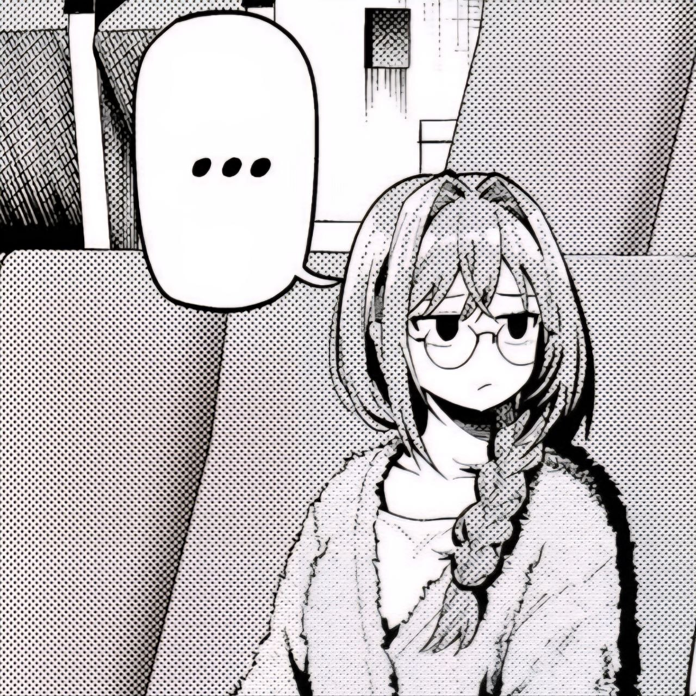

<h1>
  
  Hey! Nice to see you.
</h1>

  I'm Daniil aka «Rezy», Frontend developer from
   <b>Tver, Russia</b>.
   
  Building product UIs with Next.js and TypeScript. Care about DX, UI consistency and performance.

<h3>Interests</h3>
<ul>
  <li>Design systems and scalable UI</li>
  <li>Frontend architectures (FSD, BEM, etc.)</li>
</ul>

<h3>Socials</h3>

<h3>Main stack</h3>

  
  
  
  
  
  
  
  

<h3>My other frontend tools</h3>

  
  
  
  
  
     
  
  
  
  
  
  
  
  
  
  
  
  

<h3>Languages I know/used</h3>

  
  
  
  
  
  

<h3>My inspiration</h3>

Inohana Rikka

